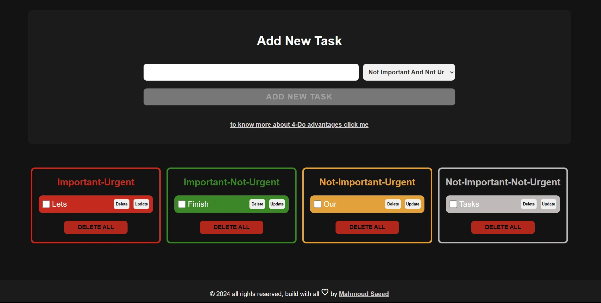

## Conquer Your To-Do's with the Eisenhower Matrix!
This project presents a web application built with **HTML, CSS, and JavaScript** to implement the renowned **Eisenhower Matrix** for effective task prioritization.

**Live Demo:** https://4-do.vercel.app/

### ✨ Features:

-   **Effortless Task Management:**  Create, Read, Update, and Delete (CRUD) tasks with ease, seamlessly integrated with eye-catching animations.
-   **Prioritize Like a Pro:**  Select the importance level for each task before adding it, ensuring focused efforts.
-   **Mark Your Wins:**  Celebrate completed tasks by simply checking them off the list, accompanied by satisfying animations.
-   **Validation Power:**  String validations ensure you enter valid task information for a smooth experience.
-   **User-Friendly Design:**  A clear and engaging interface facilitates effortless interaction.
-   **Solid Principles:**  This project is developed meticulously following proven software design principles to guarantee maintainability and scalability.
-   **High Performance:**  Achieve a perfect Lighthouse score of 100, ensuring optimal performance, accessibility, SEO, and user experience.
-   **responsive design:** this projects is fully responsive and match all screen devices
### Understanding the Eisenhower Matrix:

The Eisenhower Matrix is a productivity tool that categorizes tasks based on **urgency and importance**, enabling users to prioritize effectively. By classifying tasks into four quadrants, you can determine what needs immediate attention, what can be delegated, and what can be scheduled for later.

### ‍♀️ Using the App:

1.  **Adding Tasks:**
    -   Enter the task description in the designated input field.
    -   Select the appropriate importance level using the provided dropdown menu.
    -   Click the "Add New Task" button to create the task - enjoy the smooth UI transitions! ✨
2.  **Completing Tasks:**
    -   Click the checkbox corresponding to the completed task to mark it as done ✅.
3.  **Updating Tasks:**
    -   Click on the task you wish to edit.
    -   Modify the description and/or importance level as needed.
    -   Click the "Update" button to save the changes ➡️.
4.  **Deleting Tasks:**
    -   Click the "Delete" button next to the task you want to remove ❌.

### ️ Technologies Used:

-   **HTML:**  Provides the structure and content of the web page.
-   **CSS:**  Enhances the visual appeal and user experience through styling and elegant animations ✨.
-   **JavaScript:**  Imparts interactivity, functionality, and seamless animation logic .
### Contributing:

We encourage active participation in this project! Here's how you can contribute:

-   **Fork the repository.**
-   **Introduce new features or improvements.**
-   **Address bugs and refine existing code.**
-   **Submit pull requests for your contributions. ⬆️**

Your valuable effort towards enhancing this project is highly appreciated!
## 🛠 Skills
Javascript, HTML, CSS...

